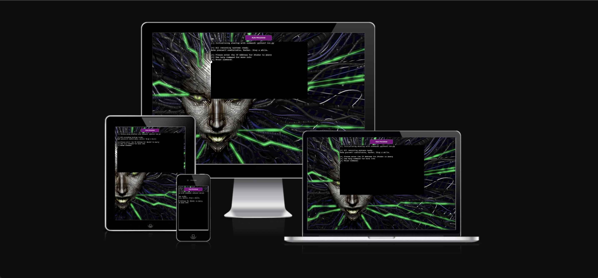
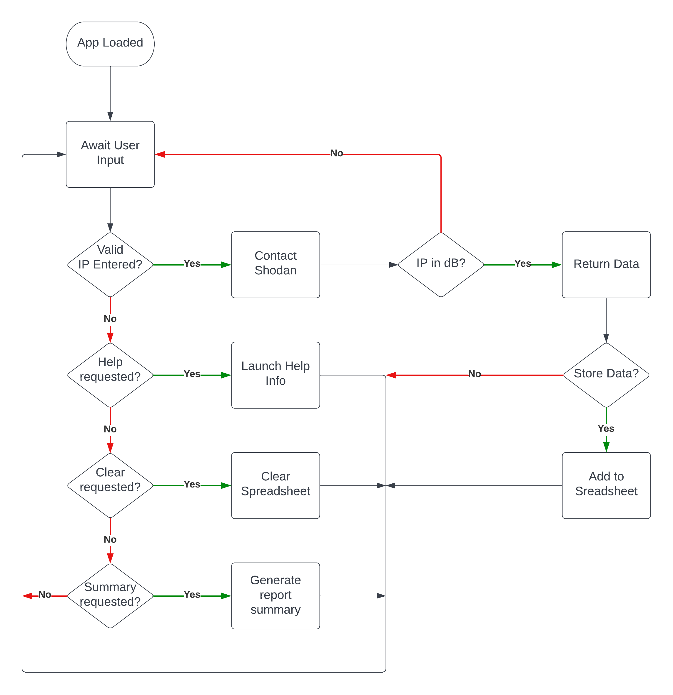

# Shodan CLI Tool

(Developer: Gary Grant)



[Live Site](https://bhero-shodan.herokuapp.com/) is hosted on heroku as a node.js app running python 3 code.

## About

As part of professional services pentration testers utilise Open-source intelligence (OSINT) gathering on public facing endpoints to learn as much as they can about target environments.
Often the tools used by testers are independent of one another and require translating of results into a common data format that is more easily digestible by the buisness.
This presented a gap I gap where I could explore using python to reach a remote endpoint and provide data to report in a csv friendly format.

For my submission for PP3 in the Code Institute Full Stack Developer Course I developed a command line tool to interact with the shodan search engine API and read/write data to Google Sheets.

> [Shodan](https://www.shodan.io/) is the first public search engine for Internet-connected devices and offers users a way to discover how exposed different endpoints are to attack.

## Table of Content

1. [Project Goals](#project-goals)
    1. [User Goals](#user-goals)
    2. [Owner Goals](#owner-goals)
2. [User Experience](#user-experience)
    1. [Target Audience](#target-audience)
    2. [User Requirements and Expectations](#user-requirements-and-expectations)
    3. [User Manual](#user-manual)
    4. [User Stories](#user-stories)
3. [Design](#design)
    1. [Design Considerations](#design-considerations)
    2. [Colour](#colour)
    3. [Fonts](#fonts)
    5. [Imagery](#imagery)
    4. [Structure](#structure)
    5. [Workflow](#workflow)
4. [Technologies Used](#technologies-used)
    1. [Languages](#languages)
    2. [Frameworks and Tools](#frameworks-and-tools)
    3. [Libraries](#libraries)
5. [Features](#features)
    1. [Future Implementations](#future-implementations)
    2. [Accessibility Features](#accessibility-features)
6. [Testing](#testing)
    1. [Python Validation](#python-validation)
    2. [Testing User Stories](#testing-user-stories)
8. [Bugs](#bugs)
9. [Deployment & Local Development](#deployment)
10. [Credits](#credits)
11. [Acknowledgments](#acknowledgments)

## Project Goals 

### User Goals
+ Discover the capabilities of the tool
+ Recieve instructions on how to use the tool
+ Discover if the Shodan dB knows about my iP addresses

### Owner Goals
+ Create an application that allows users to query the shodan API within the limits of the free tier
+ Enable users to record results of their scan for future reporting.
+ Present the solution in a web based format (heroku)

## User Experience

### Target Audience

Security enthusiasts/professionals interested in reporting on the status of their external infrastructure or penetration testers looking for low hanging fruit targets.

### User Requirements and Expectations

+ A simple, error-free experience
+ Straightforward navigation
+ Ability to store/review results

### User Manual

TODO

### User Stories

1. 
2. 
3. 
4. 
5. 
6. 
7. 
8. 
9. 
10. 


## Design

As a basic terminal app the need for graphical design is limited, readability and ease of use are paramount.
The graded submission required hosting a terminal implementation within a node.js web app making it the primary area to explore a little creativity.

### Design Considerations

The orginal concept for the project was to provide a scanning tool that leverages the shodan API to activley scan any endpoint on the internet and then allow storage of the results in a summary fashion in a Google Spreadsheet.

After playing with a PoC for a while it became evident that due to the nature of the public way in which the submissions are graded there were a few immediate considerations I needed to address.

1. Vulnerability Scanning is not legal without the site owner's permission and disruptive scanning can cause a Denial of Service (DoS) to their owner.
2. Any Scans performed by this tool would utilise a private API key which would link to my account potentially making me liable for damages. For the submission only the search shodan's dB for existing results was implemented, as Shodan already has the results
3. Multiple users means multiple report sheets/workbooks, while in a local single user environment this is fine a publicly hosted solution (like in heroku) could be abused and tally up significant cost to me, thus storage restrictions were implemented.
4. The remote hosting solution meant that I needed a remote endpoint to write results to, thus local dB solutions like tinydB and sqlite would not be practical without increasing comlexity.

Although points 2 & 3 could be remedied via a Secure User Management system with a backing dB, a relational databse's incorporation is beyond the scope of this project.

### Colour

As a basic terminal app the need for graphical design is limited, readability and ease of use are paramount.
The graded submission required hosting a terminal implementation within a node.js web app making it the primary area to explore a little creativity.

Base white text on a black background was selected for the terminal colours, the only colour edits to the html template was to change the initial red colouration to purple to better fit withinthe shodan background image discussed below. 

### Fonts

The terminal provided by the heroku app was a little limited with regards to shell features, I stuck with the default font provided.
This means that when running locally users will benefit from the customisations in their own environment.

As a hacker's tool I elected to follow the terminal messaging convention in the orginal [metasploit framework](https://www.metasploit.com/) in order to assist the user in differentiating the different message types on screen. 

+ [+] Execution occured as planned or input required
+ [-] Verbose message that an error has taken place because of design limitation
+ [!] Informational statement 


### Imagery

For the site's background I used the Shodan AI Image from system shock 2 [presspack](https://igdb.se/games/system-shock-2/presskit). 
As the upstream API's name was inspired by the game's main antogonist I felt this was a fitting homage to it's history.

### Structure

After a preliminary status check the app launches into a while loop that awaits user input to execute on a special command or search shodan's dB for an IP Address.

The input runs against a validation function to check if an IP address is entered and then queries the Shodan API. 

Any other input, except terminal special functions will return the user back to this state.

In addition the special commands will always return their user back to this state once completed.

### Workflow

The Flowchart below shows the initial concept for the site. 
<br>
<details>
<summary>Flowchart </summary>
<br>

</details>

## Technologies Used

### Languages

App Functionality is all written in Python 3

HTML, CSS and JavaScript were used to create the website in heroku.

### Frameworks and Tools

[Github](https://github.com/) - To save and store the files for the website and for version control.

[Heroku Apps](https://dashboard.heroku.com/apps) (Node.js) - to host the site 

[Google Dev Tools](https://developer.chrome.com/docs/devtools/) - troubleshooting and testing features as well as implement responsive styling

[GitPod](https://www.gitpod.io/) - for active development 

[Code Institute Python Development Template](https://github.com/Code-Institute-Org/python-essentials-template) - for setting up the initial development environment

### Libraries

#### Python3 Libraries
json - used to handle json file to dictionary and vice versa.
re - used in input validation for IP Addresses.
time - used to delay output to screen.
os - used to pick up env variable files

#### Third Party Libraries
[shodan](https://pypi.org/project/shodan/) - used to query shodan web services.
[gspread](https://pypi.org/project/gspread/) - add and manipulate data in Google Sheets.
[google-auth-oauthlib](https://pypi.org/project/google-auth-oauthlib/) - used to set up the authentification needed to access the Google API and Google Sheets. 

## Features
Summary of site.

+ Feature 1:

  + Summary of feature
    + User Stories Covered: X
    + Scrrenshot. <br> 

+ Feature 2:

  + Summary of feature
    + User Stories Covered: X
    + Scrrenshot. <br> 

+ Feature 3:

  + Summary of feature
    + User Stories Covered: X
    + Scrrenshot. <br> 

+ Feature 4:

  + Summary of feature
    + User Stories Covered: X
    + Scrrenshot. <br> 


### Future Implementations

+ Live Scans.
+ Reporting Automation - emails, summaries etc.
+ more API functionality
+ create/modify reports for individual users

## Testing

### Python Validation

PEP8 Linting was implemented to test python code format via the pylint plugin in Visual Studio Code.

PEP8 Results - No Errors Found


X Warnings displayed

| **Level** | **Feature** | **Issue Description** | **Comment** |
|-------------|-------------|----------------------|-------------|
| Warning | Feature name / line | Descrition | Comments |


### Testing user stories

1. As a __Test Persona__, I would like to do some stuff.

| **Feature** | **Action** | **Expected Result** | **Actual Result** |
|-------------|------------|---------------------|-------------------|
| Fature | Steps | Expectations  | Works as expected |


<br>
<details>
<summary>Story Results</summary>
<br>

</details>

## Bugs

Every time the Y was selected the report was overwritten, fixed by removing kickstart logic to external function and the controls to validate user input logic

### Big Bug One

Bug summary

Steps to replicate

[ref](https://developer.mozilla.org/en-US/docs/Web/CSS/:autofill)

## Deployment & Local Development

All of the following steps require a logged in github account


### How to Fork
To fork this repository:

1. Go to the repository for this project.
2. Click the Fork button in the top right corner.

### Deployment

> TODO: update this

A custom Heroku app was used to deploy the demo website, however deploying the code for local use can be accomplished by can be accomplished by cloning the release branch: 

``` sh
git clone <url>
```

in your python 3 env (use venv as required), move to the directory that you have cloned the code to and run:

``` sh
pip install -r requirements.txt
```

This will download the required 3rd party packages from your a remote repo (PyPi has the required libraries).

Next create `secrets.json` with your API key from SHODAN.io

``` json
{
  "SHODAN_API_KEY" : "YOUR API KEY"
}
```

Next create a Google IAM service account and a workbook called `shodan` in Google Sheets.

The `gspread_secrets.json` is the key details for your service_account in json format, the email value for the __client_email__ key should be given editor permissions to your `shodan` workbook.

``` json
{
  "type": "service_account",
  "project_id": "",
  "private_key_id": "",
  "private_key": "",
  "client_email": "",
  "client_id": "",
  "auth_uri": "",
  "token_uri": "",
  "auth_provider_x509_cert_url": "",
  "client_x509_cert_url": "",
}
```

Start the app with:

``` sh
python run.py
```

As this is the first run of the app, set up the workbook by running the `clear report` command in the tool.

This will set up the backend for use.

### How to Clone
To clone this repository (with the heroku dependencies):

1. Go to the repository for this project and select the main branch.
2. Click on the code button, select whether you would like to clone with HTTPS, SSH or GitHub CLI and copy the link shown.
3. Open the terminal in your code editor and change the current working directory to the location you want to use for the cloned directory.
4. Type 'git clone' into the terminal and then paste the link you copied in step 3. Press enter.

## Credits

### Code Used


### Content
Text Content for the website was written by the Crytek Employees and was ourced from the store [Page](https://eu-shop.crytek.com/games/hunt-showdown).
Block quotes for testimonials are cited within the web documents.

### Media
Images from the System Shock 2 [presspack](https://igdb.se/games/system-shock-2/presskit)

## Acknowledgments
I would like to acknowledge the following people who helped me along the way in completing my first CI project:

Nightdive Studios - Creator System Shock 2 for inspiring the cration of the shodan tool and presspack.

Shodan.io - Creator of the Shodan API and datastores that were used to collect the search data

My In House Red Team - (You know who you are!) for inspiring the use case for the project

Mo Shami - for being the mentor that set me on the right path and provided me with mid and final feedback prioir to submission.